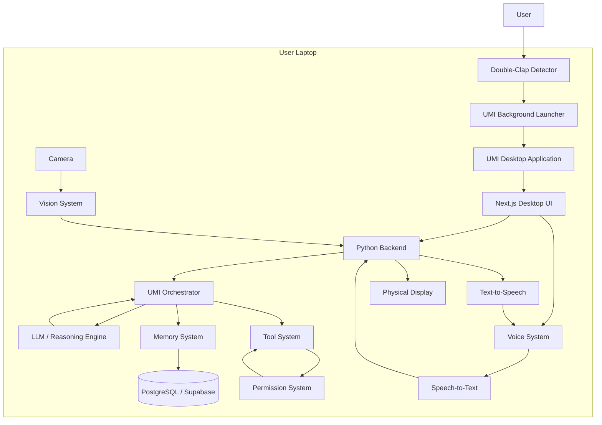
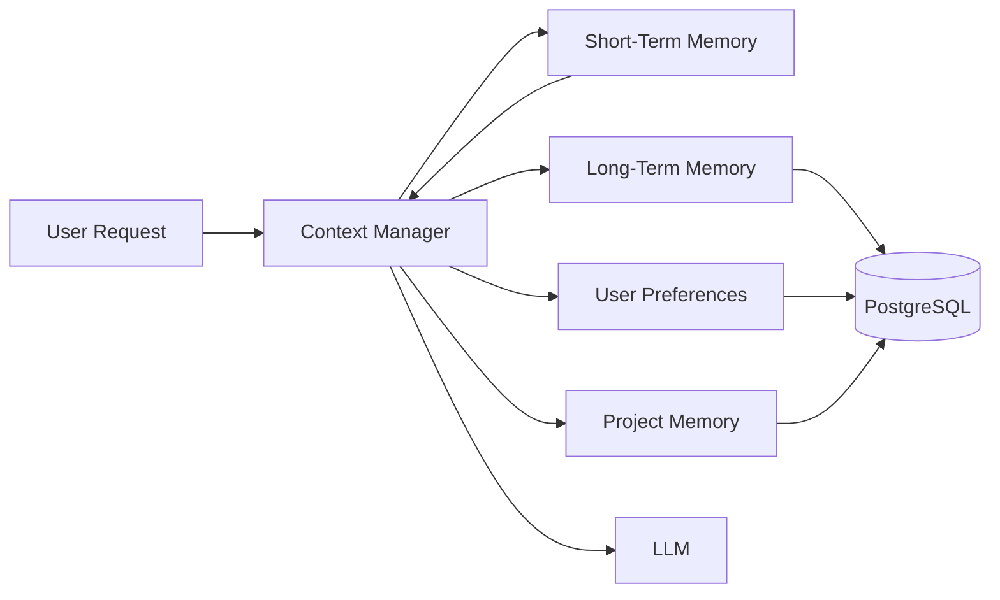
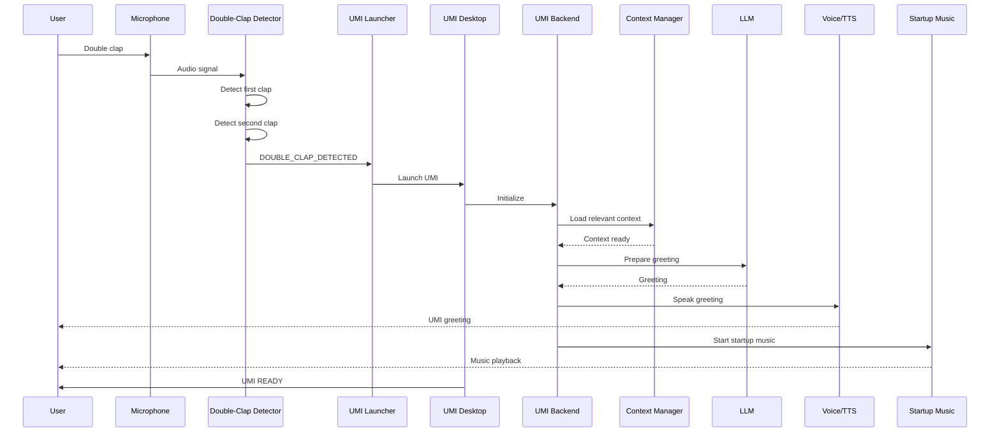
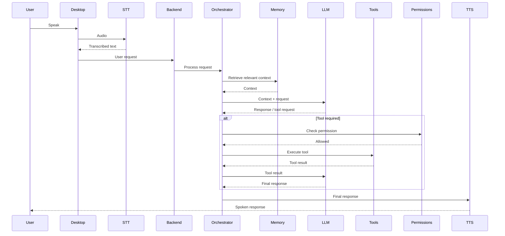

# UMI — System Architecture

## 1. Purpose

This document defines the technical architecture of UMI.

UMI is a personal multimodal AI assistant designed to operate as a real desktop application and eventually as a physical and ambient AI system.

The architecture must support:

* Natural conversation
* Long-term and short-term memory
* Tool use
* Gmail and Calendar integration
* Voice interaction
* Proactive assistance
* Desktop interaction
* Physical display
* Computer vision
* Gesture recognition
* IoT
* Robotics
* Future multimodal capabilities

The architecture must be modular so that new capabilities can be added without rewriting the entire system.

---

# 2. Core Architectural Philosophy

The most important principle of UMI is:

> The LLM is UMI's reasoning engine, not UMI itself.

UMI is the complete system.

```text
UMI
│
├── User Interfaces
│   ├── Desktop UI
│   ├── Voice
│   ├── Physical Display
│   └── Future AR / Wearables
│
├── Input Systems
│   ├── Keyboard
│   ├── Microphone
│   ├── Camera
│   ├── Gesture Detection
│   └── Future Sensors
│
├── Backend / Orchestrator
│   ├── Authentication
│   ├── Context Management
│   ├── Memory
│   ├── Tool Management
│   ├── Permissions
│   ├── Task Management
│   └── Event Processing
│
├── AI Reasoning
│   └── LLM
│
├── Tools & Integrations
│   ├── Gmail
│   ├── Calendar
│   ├── Web
│   ├── Files
│   ├── Computer Control
│   └── Future IoT / Robotics
│
└── Data Layer
    ├── PostgreSQL
    ├── Conversation History
    ├── Memory
    └── System State
```

The LLM should never have unrestricted direct access to the computer, database, email, filesystem, or hardware.

The backend controls what the LLM is allowed to do.

---

# 3. High-Level Architecture



---

# 4. Desktop-First Architecture

UMI must not be treated as a localhost website in the final product.

During development, localhost is acceptable.

For example:

```text
Development:

Next.js
    ↓
localhost
    ↓
Python backend
```

But the final user experience should be:

```text
Laptop
    ↓
UMI Desktop Application
    ↓
UMI frontend
    ↓
UMI backend
    ↓
UMI AI systems
```

The user should not have to manually open:

```text
localhost:3000
```

or:

```text
localhost:8000
```

in a browser to use UMI.

The application should behave like a normal desktop application.

---

# 5. Desktop Application Architecture

The desktop application is the primary computer interface for UMI.

Conceptually:

```text
UMI Desktop
│
├── Application Window
│
├── UMI Visual Interface
│
├── Conversation Interface
│
├── Voice Interface
│
├── Notifications
│
├── System State
│
└── Connection to UMI Backend
```

The exact desktop technology should be selected during Phase 0 after evaluating:

* Cross-platform support
* Performance
* Native OS integration
* Microphone access
* Startup behavior
* Background processes
* Security
* Packaging
* Auto-update support
* Hardware integration

Do not choose a desktop framework simply because it is popular.

The framework must serve UMI's architecture.

---

# 6. UMI Background Launcher

A special background process is required for the double-clap startup experience.

This component exists independently from the main UMI desktop window.

Its responsibility is:

```text
Laptop running
      ↓
Background launcher active
      ↓
Microphone monitoring
      ↓
Detect double clap
      ↓
Launch UMI Desktop
```

The launcher should be lightweight.

It should NOT:

* Run the main LLM continuously
* Load the complete UMI backend unnecessarily
* Continuously send audio to the LLM
* Store raw microphone recordings permanently
* Have unrestricted system permissions

Its primary job is:

> Detect the defined activation signal and launch UMI.

---

# 7. Double-Clap Detection

The double-clap system is an activation mechanism.

Expected behavior:

```text
👏
   short interval
👏
   ↓
DOUBLE CLAP DETECTED
```

The detector should distinguish a deliberate double clap from ordinary environmental noise as reliably as possible.

The implementation should include:

* Audio input
* Short audio buffers
* Clap detection
* Amplitude analysis
* Timing analysis
* Noise threshold
* Debouncing
* False-positive protection
* Configurable sensitivity

Conceptual algorithm:

```text
Audio input
     ↓
Detect transient sound
     ↓
Is it clap-like?
     ↓
YES
     ↓
Record timestamp
     ↓
Wait for second clap
     ↓
Second clap detected within allowed window?
     ↓
YES
     ↓
DOUBLE CLAP EVENT
```

The timing window and sensitivity should be configurable.

---

# 8. Double-Clap Security Considerations

Double-clap activation should only launch or wake UMI.

It must NOT automatically authorize sensitive actions.

For example:

```text
Double clap
    ↓
Open UMI
```

is acceptable.

But:

```text
Double clap
    ↓
Send email
```

is NOT acceptable.

The double clap is an activation signal, not an authorization mechanism.

Sensitive actions must still use the normal permission system.

---

# 9. UMI Startup Sequence

The startup experience should feel intentional and polished.

Target experience:

```text
Laptop is active
       ↓
👏 👏
       ↓
Double clap detected
       ↓
UMI Desktop launches
       ↓
UMI initializes
       ↓
Boot / visual animation
       ↓
Greeting
       ↓
Music begins
       ↓
UMI becomes ready
```

The initial target is approximately:

> 10–15 seconds from launch to fully ready UMI experience.

However, this should not be implemented as a meaningless fixed delay.

Instead:

```text
Launch
  ↓
Initialize required services
  ↓
Check system state
  ↓
Load user context
  ↓
Initialize voice
  ↓
Initialize conversation system
  ↓
Ready
  ↓
Greeting + startup experience
```

If initialization finishes faster, UMI should not unnecessarily wait.

If initialization takes longer, the UI should communicate the current state.

---

# 10. Startup State Machine

UMI should have explicit startup states.

```text
OFF
 ↓
LAUNCHING
 ↓
INITIALIZING
 ↓
LOADING_CONTEXT
 ↓
READY_TO_GREET
 ↓
GREETING
 ↓
STARTUP_MEDIA
 ↓
READY
```

Possible failure states:

```text
INITIALIZATION_ERROR
VOICE_ERROR
LLM_ERROR
DATABASE_ERROR
MEDIA_ERROR
PERMISSION_ERROR
```

The system must fail gracefully.

For example, if music cannot play:

```text
UMI still starts
        ↓
Greeting works
        ↓
Music failure is logged
        ↓
UMI continues normally
```

Music must never prevent the AI assistant from starting.

---

# 11. Greeting System

The greeting should be generated or selected by UMI based on context.

Examples:

```text
"Good morning. I'm online."

"Welcome back. I'm ready."

"Good evening. How was your day?"

"Systems are online. What are we working on?"
```

The greeting system may eventually consider:

* Time of day
* User preferences
* Previous session
* Calendar
* Current tasks
* Recent events
* UMI personality
* User mood signals if explicitly supported

However, the first implementation should remain simple.

---

# 12. Startup Music

UMI may play a user-selected startup track after or during the greeting.

Initial concept:

```text
UMI launches
      ↓
Greeting
      ↓
"Back in Black" starts
      ↓
UMI becomes ready
```

The music system should be modular.

Do not hard-code the music provider into the core architecture.

Possible future sources could include:

* Local audio files
* OS media player
* User-selected music service
* User-defined startup sound

The user must have control over:

* Enable/disable startup music
* Selected track
* Volume
* Startup timing
* Whether music interrupts existing playback

Music playback is an interface/media capability, not an AI reasoning capability.

---

# 13. Main Conversation Flow

When the user speaks to UMI:

```text
User
 ↓
Microphone
 ↓
Voice Activity Detection
 ↓
Speech-to-Text
 ↓
Desktop Application
 ↓
Python Backend
 ↓
Orchestrator
 ↓
Context Manager
 ↓
Memory Retrieval
 ↓
LLM
 ↓
Tool Decision
 ↓
Permission Check
 ↓
Tool Execution
 ↓
Tool Result
 ↓
LLM
 ↓
Final Response
 ↓
Text-to-Speech
 ↓
Speaker
```

For typed input:

```text
User
 ↓
Desktop UI
 ↓
Python Backend
 ↓
Orchestrator
 ↓
Context + Memory
 ↓
LLM
 ↓
Response
 ↓
Desktop UI
```

---

# 14. UMI Orchestrator

The orchestrator is the central coordination layer.

It should not itself be the LLM.

Its responsibility is to coordinate:

* User input
* Context
* Memory
* LLM
* Tools
* Permissions
* Responses
* Logging
* State
* Events

Conceptually:

```text
                ORCHESTRATOR
                     │
        ┌────────────┼────────────┐
        ↓            ↓            ↓
     Context       Memory        LLM
        │                         │
        └──────────┬──────────────┘
                   ↓
              Tool Decision
                   ↓
             Permission Check
                   ↓
             Tool Execution
                   ↓
               Tool Result
                   ↓
                  LLM
                   ↓
             Final Response
```

The orchestrator is the control center of UMI.

---

# 15. LLM Architecture

The selected LLM is a replaceable reasoning component.

UMI should communicate with the LLM through an abstraction layer.

Conceptually:

```text
UMI Orchestrator
       ↓
LLM Manager
       ↓
LLM Provider
       ↓
Selected Model
```

The rest of UMI should not depend directly on a specific model implementation.

This allows future replacement of the model without redesigning UMI.

For example:

```text
Current Model
     ↓
Future Model
     ↓
Another Model
```

without changing:

```text
Memory
Tools
Permissions
Frontend
Desktop application
```

---

# 16. Tool Architecture

The LLM should never directly execute external actions.

Instead:

```text
LLM
 ↓
Tool Request
 ↓
Tool Manager
 ↓
Validate Input
 ↓
Permission Check
 ↓
Execute Tool
 ↓
Validate Result
 ↓
Return Result
 ↓
LLM
```

Example:

```text
User:
"Check my emails."

LLM:
"I need the Gmail tool."

Backend:
"Is this tool available?"

Permission system:
"Read access allowed."

Gmail tool:
"Retrieve emails."

Result:
"5 relevant emails."

LLM:
"Summarize them."

UMI:
"You have 5 relevant emails..."
```

---

# 17. Tool Interface

Every tool should have a standardized interface.

A tool should define:

* Name
* Description
* Purpose
* Input schema
* Output schema
* Permissions required
* Authentication requirements
* Failure behavior
* Logging requirements
* Confirmation requirements

Conceptual structure:

```text
Tool
│
├── Metadata
├── Input Schema
├── Permission Level
├── Authentication
├── Execution
├── Output Validation
└── Logging
```

This allows new tools to be added without changing the core orchestrator.

---

# 18. Permission Architecture

UMI must follow:

> Reasoning does not equal authorization.

The LLM can recommend an action.

The backend decides whether the action is allowed.

Permission levels:

```text
LEVEL 1 — READ
    Read email
    Read calendar
    Read files

LEVEL 2 — WRITE
    Create task
    Create calendar event
    Create draft email

LEVEL 3 — SENSITIVE
    Send email
    Change important settings

LEVEL 4 — DESTRUCTIVE
    Delete files
    Delete emails
    Cancel important events

LEVEL 5 — HIGH RISK
    Arbitrary computer control
    Arbitrary shell commands
    Hardware control
```

Sensitive and destructive operations require appropriate confirmation.

---

# 19. Memory Architecture

UMI memory should be separated into different categories.

```text
Memory
│
├── Current Conversation
│
├── Short-Term Context
│
├── Long-Term Memory
│
├── User Preferences
│
├── Project Memory
│
├── Task Memory
│
└── Knowledge / Documents
```

Not every conversation message should become permanent memory.

Memory should be:

* Selective
* Relevant
* User-controlled
* Deletable
* Auditable where appropriate

---

# 20. Context Management

UMI should not send the entire memory database to the LLM for every request.

Instead:

```text
User Request
      ↓
Context Manager
      ↓
Determine Relevant Context
      ↓
Retrieve Relevant Memory
      ↓
Combine Current Conversation
      ↓
Build LLM Context
      ↓
LLM
```

This reduces:

* Token usage
* Latency
* Noise
* Privacy exposure
* Confusion

---

# 21. Memory + LLM Architecture



---

# 22. Database Architecture

The primary structured data store should be PostgreSQL through the selected database platform.

Expected entities include:

```text
Users
Conversations
Messages
Memories
Preferences
Projects
Tasks
Reminders
Tool Calls
Tool Results
Permissions
OAuth Connections
Calendar Events
Email Metadata
System Events
Audit Logs
```

The exact schema should be finalized during implementation.

---

# 23. Gmail Architecture

Gmail must be treated as an external integration.

```text
UMI
 ↓
Gmail Tool
 ↓
Permission Check
 ↓
OAuth Token
 ↓
Gmail API
 ↓
Result
 ↓
UMI
```

UMI should never store a user's raw Google password.

OAuth should be used.

---

# 24. Calendar Architecture

Calendar follows the same pattern:

```text
UMI
 ↓
Calendar Tool
 ↓
Permission Check
 ↓
OAuth
 ↓
Calendar API
 ↓
Result
 ↓
UMI
```

Examples:

```text
"What's on my calendar today?"

"Schedule a meeting tomorrow."

"Do I have anything at 5 PM?"
```

---

# 25. Voice Architecture

Voice is a separate subsystem.

```text
Microphone
 ↓
Voice Activity Detection
 ↓
Speech-to-Text
 ↓
UMI Backend
 ↓
Orchestrator
 ↓
LLM
 ↓
Response
 ↓
Text-to-Speech
 ↓
Speaker
```

The system should eventually support:

* Streaming speech
* Low latency
* Wake/activation mechanisms
* Interruptions
* Barge-in
* Natural turn detection
* Silence detection
* Error handling

---

# 26. Voice vs Double-Clap Activation

These are different concepts.

### Double clap

Purpose:

> Launch or activate UMI.

### Voice conversation

Purpose:

> Communicate with UMI after it is active.

Therefore:

```text
DOUBLE CLAP
    ↓
Activate / Launch UMI
    ↓
UMI Startup
    ↓
Voice system becomes available
    ↓
Normal conversation
```

Do not mix the two systems unnecessarily.

---

# 27. Physical Display Architecture

The physical display is only an interface.

It is not the UMI brain.

```text
UMI Backend
      ↓
Display Controller
      ↓
Physical Display
```

Possible states:

```text
IDLE
LISTENING
THINKING
USING_TOOL
SPEAKING
ERROR
STARTING
READY
```

The display can show:

* UMI visualizer
* Listening state
* Thinking state
* Tool activity
* Calendar
* Tasks
* Notifications
* System status
* Startup animation

---

# 28. Vision Architecture

Future computer vision:

```text
Camera
 ↓
Vision Processing
 ↓
Detected Information
 ↓
Visual Context
 ↓
UMI Orchestrator
 ↓
LLM
```

The LLM should not necessarily process every raw video frame.

Vision processing should extract useful information first.

---

# 29. Gesture Architecture

Gesture recognition:

```text
Camera
 ↓
Hand / Body Detection
 ↓
Gesture Classification
 ↓
Gesture Event
 ↓
UMI Backend
 ↓
Permission Check
 ↓
Action
```

Example:

```text
Hand gesture
 ↓
Recognized as "pause"
 ↓
Validate gesture
 ↓
Permission check
 ↓
Pause media
```

Gesture recognition must not bypass UMI's security architecture.

---

# 30. Proactive UMI Architecture

Eventually UMI should be capable of proactively informing the user.

For example:

```text
Calendar Event Approaching
        ↓
Event Processor
        ↓
User Preference Check
        ↓
Quiet Hours Check
        ↓
Notification Decision
        ↓
UMI Notification
```

UMI should not constantly interrupt the user.

Proactive behavior should be:

* Relevant
* Configurable
* Explainable
* User-controlled
* Context-aware

---

# 31. Computer Control Architecture

Computer control is a high-risk capability.

UMI should never receive unrestricted operating-system access from the LLM.

Instead:

```text
User
 ↓
LLM
 ↓
Computer Tool
 ↓
Allowlist
 ↓
Permission Check
 ↓
Confirmation if necessary
 ↓
Execute Action
 ↓
Audit Log
```

Examples of controlled operations:

```text
Open application
Open file
Create file
Move file
Search filesystem
Control media
Navigate approved applications
```

Arbitrary shell execution should NOT be part of the normal UMI architecture.

---

# 32. IoT Architecture

Future IoT:

```text
UMI
 ↓
IoT Tool Layer
 ↓
Device Registry
 ↓
Permission System
 ↓
Device Gateway
 ↓
Microcontroller
 ↓
Physical Device
```

Example:

```text
"Turn on my desk light."

UMI
 ↓
IoT Tool
 ↓
Permission
 ↓
Desk Light Controller
 ↓
Light ON
```

---

# 33. Robotics Architecture

Robotics should be treated as a separate engineering layer.

```text
UMI AI
 ↓
Robotics Command Layer
 ↓
Robot Controller
 ↓
Sensors
 ↓
Control System
 ↓
Motors / Actuators
 ↓
Physical World
```

Future components may include:

* Microcontrollers
* Cameras
* Distance sensors
* IMUs
* Motors
* Motor controllers
* Robotics middleware
* Navigation
* Computer vision
* Sensor fusion
* Control systems
* Mechanical systems

The AI should not directly control motors without a safety/control layer.

---

# 34. Event Architecture

UMI will eventually be event-driven.

Examples:

```text
DOUBLE_CLAP_DETECTED
APP_STARTED
SYSTEM_READY
USER_SPOKE
USER_STOPPED_SPEAKING
TOOL_STARTED
TOOL_COMPLETED
CALENDAR_EVENT_APPROACHING
EMAIL_RECEIVED
TASK_DUE
CAMERA_EVENT
GESTURE_DETECTED
DEVICE_STATE_CHANGED
```

Events should be standardized.

Conceptually:

```text
Event
 ↓
Event Router
 ↓
Relevant Handler
 ↓
UMI Orchestrator
 ↓
Action / Response
```

---

# 35. Failure Isolation

Failure in one subsystem should not destroy the entire assistant.

Example:

```text
Music fails
    ↓
UMI still works
```

```text
Gmail unavailable
    ↓
Conversation still works
```

```text
Camera unavailable
    ↓
Voice still works
```

```text
Calendar unavailable
    ↓
Other tools still work
```

The architecture should prefer graceful degradation.

---

# 36. Logging and Observability

UMI should maintain structured logs for important system events.

Examples:

```text
Application Started
Double Clap Detected
Tool Called
Tool Failed
Permission Requested
Permission Denied
LLM Request
LLM Failure
Voice Failure
Integration Failure
System Error
```

Sensitive information should not be unnecessarily stored in logs.

---

# 37. Security Principles

UMI should follow these principles:

1. Least privilege
2. Explicit permissions
3. Separation of reasoning and execution
4. Secure secret management
5. OAuth for external services
6. No plaintext passwords
7. No unrestricted shell access
8. Confirmation for sensitive operations
9. Audit important actions
10. Validate all tool inputs
11. Validate tool outputs
12. Protect personal data
13. Minimize stored data
14. Allow user control over memory
15. Fail safely

---

# 38. Frontend / Backend Boundary

The frontend should handle:

* UI
* Conversation display
* Visual states
* User input
* Voice interface
* Notifications
* Settings
* Startup animation

The backend should handle:

* Business logic
* Authentication
* Orchestration
* LLM communication
* Memory
* Tools
* Permissions
* Integrations
* Tasks
* Logging
* System state

Do not place core business logic inside the frontend.

---

# 39. Desktop / Backend Boundary

The desktop application provides the local user interface and operating-system integration required by UMI.

The backend remains responsible for intelligence and orchestration.

Conceptually:

```text
Desktop Application
       │
       ├── UI
       ├── Microphone
       ├── Speaker
       ├── Notifications
       ├── Startup
       └── OS Integration
                │
                ↓
          UMI Backend
                │
       ┌────────┼────────┐
       ↓        ↓        ↓
      LLM     Memory    Tools
```

The exact process boundaries may evolve during implementation.

---

# 40. Local vs Remote Services

Not everything needs to run locally.

The architecture should support both:

```text
LOCAL
- Desktop UI
- Background launcher
- Microphone
- Speaker
- OS integration
- Some processing
```

and potentially:

```text
REMOTE / CLOUD
- LLM
- Database
- External APIs
- Some AI processing
```

The system should not assume that every component must run on localhost.

The final product is a desktop application even if some backend services are remote.

---

# 41. Development Environment

During development it is acceptable to use:

```text
Next.js development server
Python development server
localhost
```

For example:

```text
Next.js → localhost:3000
Python → localhost:8000
```

This is only a development configuration.

It must not define the final user experience.

---

# 42. Production Architecture

The production experience should look like:

```text
User Laptop
│
├── UMI Background Launcher
│
├── UMI Desktop Application
│
│    ├── UMI UI
│    ├── Voice Interface
│    ├── Startup Experience
│    └── OS Integration
│
└── UMI Backend Services
     │
     ├── Orchestrator
     ├── LLM Manager
     ├── Memory
     ├── Tools
     ├── Permissions
     ├── Tasks
     └── Integrations
```

The user should be able to interact with UMI like a normal installed application.

---

# 43. Complete Startup Architecture

The complete startup flow is:



---

# 44. Complete Conversation Architecture



---

# 45. Core Architectural Rules

These rules should remain stable throughout development.

### Rule 1

> The LLM is not the application.

### Rule 2

> The backend controls actions.

### Rule 3

> Tools are the controlled interface to the outside world.

### Rule 4

> Permissions are enforced outside the LLM.

### Rule 5

> Memory is selective.

### Rule 6

> The desktop application is the primary user interface.

### Rule 7

> Localhost is a development environment, not the final product experience.

### Rule 8

> The background launcher is responsible for activation signals such as the double clap.

### Rule 9

> Double clap activates UMI but does not authorize sensitive actions.

### Rule 10

> Failure in one subsystem should not unnecessarily break the rest of UMI.

### Rule 11

> New capabilities should be implemented as modular components.

### Rule 12

> Hardware must have safety and control layers between AI decisions and physical actions.

### Rule 13

> Security and user control take priority over convenience.

### Rule 14

> Build today's system cleanly while keeping future capabilities possible.

---

# 46. Architecture Evolution

UMI should evolve incrementally.

```text
                    UMI V1
                     │
          ┌──────────┼──────────┐
          ↓          ↓          ↓
       Desktop     Voice      Memory
          │          │          │
          └──────────┼──────────┘
                     ↓
                  Tools
                     ↓
              Gmail / Calendar
                     ↓
                Proactive AI
                     ↓
              Computer Control
                     ↓
                  Vision
                     ↓
                  Gesture
                     ↓
                    IoT
                     ↓
                 Robotics
                     ↓
              Advanced UMI
```

Each layer should build on stable lower-level architecture.

---

# 47. Architecture Decision Principle

Whenever a new feature is proposed, ask:

1. What problem does it solve?
2. Which architectural layer owns it?
3. Does it belong in the frontend, backend, orchestrator, tool system, or hardware layer?
4. What permissions does it require?
5. What data does it need?
6. What can fail?
7. How should failure be handled?
8. How will it be tested?
9. Does it introduce security risks?
10. Can it be implemented without breaking existing capabilities?
11. Is it needed now or should it remain a future capability?

Do not add complexity simply because the technology is available.

---

# 48. Current Priority

The immediate architectural priority is:

```text
DOUBLE CLAP
     ↓
BACKGROUND LAUNCHER
     ↓
UMI DESKTOP APPLICATION
     ↓
STARTUP SEQUENCE
     ↓
GREETING
     ↓
STARTUP MUSIC
     ↓
UMI READY
     ↓
VOICE CONVERSATION
```

This should be implemented before attempting advanced:

* Vision
* Gesture
* IoT
* Robotics
* Autonomous computer control

The goal is to first make UMI feel like a real desktop AI assistant.

---

# 49. Definition of Architectural Success

The architecture is successful when:

* UMI can run as a real desktop application.
* The user does not need to manually open localhost in production.
* A background activation process can detect the configured double-clap signal.
* The double clap can launch UMI.
* UMI has a defined startup state machine.
* UMI can greet the user.
* Startup music is modular and optional.
* The desktop application communicates cleanly with the backend.
* The backend controls the LLM and tools.
* The LLM cannot directly bypass permissions.
* Memory is separated from reasoning.
* Tools are modular.
* External integrations are isolated.
* Failures are contained.
* Future voice, vision, gesture, IoT, and robotics capabilities can be added without redesigning the entire system.

---

# 50. Final Architectural Principle

UMI should not be built as:

```text
A website + an LLM
```

It should be built as:

```text
                    UMI
                     │
       ┌─────────────┼─────────────┐
       ↓             ↓             ↓
   Interfaces     Intelligence    Actions
       │             │             │
       ↓             ↓             ↓
 Desktop         LLM + Context    Tools
 Voice           Memory           Integrations
 Display         Reasoning        Computer
 Vision                            IoT
 Gesture                           Robotics
                     │
                     ↓
               Control Layer
                     │
                     ↓
               Physical World
```

The long-term vision is:

> **UMI is a personal AI operating layer that can understand the user, remember relevant context, reason about requests, safely use tools, communicate naturally, and eventually interact with the physical world.**

The desktop application is the first serious step toward that vision.
